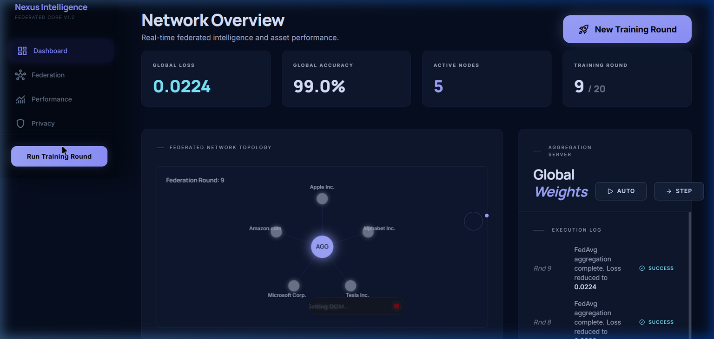

# Nexus Intelligence: Federated Learning Control Center

**Nexus Intelligence** is a cutting-edge web application built for college research demonstrations. It showcases a **Federated Learning (FedAvg)** network in real-time. Instead of gathering all sensitive data in one central location, Federated Learning allows individual nodes (clients) to train machine learning models locally. Only the insights (weights/gradients) are shared with the central server, dramatically enhancing privacy and security.

This dashboard visualizes that process, simulating real-world stock prediction data using actual historical prices for Apple, Alphabet, Tesla, Microsoft, and Amazon.

## 🚀 Features

- **Secure Access:** Client-side authentication gate simulating a secured admin portal.
- **Federated Topology Visualization:** A visual graph of the network, showing the Aggregator node and the 5 Edge clients.
- **Real-Time Training Simulation:** Click "Run Training Round" to watch the global loss decrease and accuracy increase as clients train their local datasets and average their weights.
- **Live Trading Performance Metrics:**
  - **Equity Curve:** Watch a simulated portfolio equity curve built from the aggregated model's predictions.
  - **Sharpe Ratio:** Real-time risk/reward analysis for the FedAvg model versus individual stock performance.
- **Premium Dark UI Aesthetic:** Glassmorphism UI, fluid animations using Framer Motion, and high-performance Recharts for data visualization.

---

## 🛠️ Technology Stack

- **Frontend Framework:** [React 18](https://react.dev/) + [Vite](https://vitejs.dev/)
- **Styling:** Vanilla CSS + [Tailwind CSS](https://tailwindcss.com/) (Dark Neon Cyberpunk Theme)
- **Animations:** [Framer Motion](https://www.framer.com/motion/)
- **Charts & Data Viz:** [Recharts](https://recharts.org/)
- **Icons:** [Google Material Symbols](https://fonts.google.com/icons)
- **Routing:** [React Router v6](https://reactrouter.com/)

---

## 💻 Getting Started (Local Setup)

Follow these steps to run the application on your machine for the presentation:

### Prerequisites
Make sure you have [Node.js](https://nodejs.org/) installed on your computer.

### 1. Install Dependencies
Open your terminal in the project directory and run:
`npm install`

### 2. Start the Development Server
Run the following command to start the Vite server:
`npm run dev`

### 3. Open the Application
Navigate to `http://localhost:5173` in your browser.

- You will land on the marketing presentation page (`nexus_site.html`).
- To access the control dashboard, click the dashboard link or go directly to `http://localhost:5173/login`.

### 4. Login Credentials (Demo)
Since this is a research demo, use the following credentials to access the secure dashboard:
- **Username:** `admin`
- **Password:** `nexus2026`

---

## 🧠 How the Simulation Works (Under the Hood)

For the purpose of the research demonstration, the Federated Learning system runs entirely in your browser using JavaScript, though it perfectly mimics the architecture of a real Python backend:

1. **Initialization:** The `FederatedEngine` class loads real historical JSON stock data for 5 major tech companies.
2. **Local Training:** When you click "Run Training Round", each client node simulates "training" on its own specific stock data to recognize patterns. It returns local "weights" to the server.
3. **Aggregation (FedAvg):** The server averages these weights using the standard Federated Averaging mechanism.
4. **Metrics Update:** The dashboard visually updates the Global Loss (decreasing) and Global Accuracy (increasing), then updates the equity curve chart based on the new prediction capability.

---

## 📁 Key Files & Architecture
If you need to explain the code for your college viva/presentation, point them to these important files:

- `src/simulation/federatedEngine.js` — The core logic that drives the federated learning simulation.
- `src/simulation/stockData.js` — Handles data shaping, moving averages, and MACD simulation logic.
- `src/pages/Dashboard.jsx` — The main React component tying together the Sidebar, Header, and Chart states.
- `src/components/charts/AnalyticsCharts.jsx` — Uses Recharts and `useMemo` to draw the simulated equity curves and calculate Sharpe ratios in real-time.

---

*Built with precision for advanced architectural research.*
